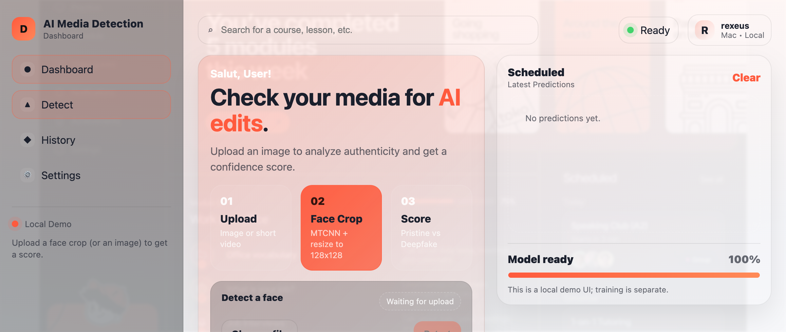
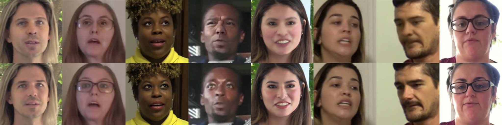

<div align="center">

# AI Media Detection

[](https://opensource.org/licenses/MIT)
[](https://www.python.org/downloads/)
[](https://www.tensorflow.org/)
[](https://keras.io/)
[](https://github.com/AdityaMalik5/ai-detect_media/stargazers)
[](https://github.com/AdityaMalik5/ai-detect_media/network/members)

<p align="center">
  
</p>

**Open-source deepfake & AI-edited media detection — train your own model with TensorFlow, Keras & EfficientNet, and analyze results through a clean local dashboard**

[Report Bug](https://github.com/AdityaMalik5/ai-detect_media/issues) · [Request Feature](https://github.com/AdityaMalik5/ai-detect_media/issues)

</div>

---

## About

**AI Media Detection** is an open-source pipeline for training **deepfake detection** and **face forgery detection** models from scratch. Built with [Python](https://www.python.org), [Keras](https://keras.io), and [TensorFlow](https://www.tensorflow.org), the detector uses an **EfficientNet** backbone trained on major public benchmarks (FaceForensics++, Celeb-DF, DFDC, and others) to recognize synthetic faces and manipulated media.

The project includes a **local web dashboard** — upload an image or short video, get a pristine vs. deepfake confidence score, and explore how the model reached its decision through interactive charts.

---

## Features

- **EfficientNet-based architecture** — State-of-the-art backbone with 128×128 input, global max pooling, and binary classification head (pristine vs deepfake).
- **Multi-dataset training** — Supports five major public benchmarks (FaceForensics++, Celeb-DF, DFDC, DFD, DeepFake-TIMIT) for robustness across ~20 synthesis methods.
- **End-to-end pipeline** — From raw videos to trained model: frame extraction → face cropping (MTCNN) → dataset balancing & split → training.
- **Local web dashboard** — Upload images or videos and get scored results with interactive explanation charts, all running in your browser.
- **Prediction history** — Track and search every scan you've made, with per-session stats.

---

## Demo

<p align="center">
  
</p>

---

## Quick Start

### Prerequisites

- **Python 3**
- **Keras**
- **TensorFlow**
- **EfficientNet** for TensorFlow Keras
- **OpenCV** on Wheels
- **MTCNN**

### Install & run

```bash
# Clone and install dependencies
git clone https://github.com/AdityaMalik5/ai-detect_media.git
cd ai-detect_media
pip install -r requirements.txt

# Run the full training pipeline (after placing your dataset videos as expected)
python 00-convert_video_to_image.py    # Extract frames
python 01a-crop_faces_with_mtcnn.py    # Crop faces with MTCNN
python 02-prepare_fake_real_dataset.py # Balance & split train/val/test
python 03-train_cnn.py                 # Train EfficientNet classifier

# Start the local dashboard
python app_server.py                   # Open http://localhost:8000
```

---

## Training Datasets

The model is trained on the following public deepfake datasets to cover diverse identities and synthesis methods:

| Dataset | Link |
|---------|------|
| DeepFake-TIMIT | [https://www.idiap.ch/dataset/deepfaketimit](https://www.idiap.ch/dataset/deepfaketimit) |
| FaceForensics++ | [https://github.com/ondyari/FaceForensics](https://github.com/ondyari/FaceForensics) |
| Google DFD | [https://ai.googleblog.com/2019/09/contributing-data-to-deepfake-detection.html](https://ai.googleblog.com/2019/09/contributing-data-to-deepfake-detection.html) |
| Celeb-DF | [https://github.com/danmohaha/celeb-deepfakeforensics](https://github.com/danmohaha/celeb-deepfakeforensics) |
| Facebook DFDC | [https://ai.facebook.com/datasets/dfdc/](https://ai.facebook.com/datasets/dfdc/) |

<p align="center">
  
</p>

**Aggregate scale (approximate):** ~134,446 videos · ~1,140 identities · ~20 synthesis methods.

---

## Pipeline Overview

| Step | Script | Description |
|------|--------|-------------|
| **0** | `00-convert_video_to_image.py` | Extract frames from videos; resize by width (2× if &lt;300px, 1× for 300–1000px, 0.5× for 1000–1900px, 0.33× if &gt;1900px). |
| **1a** | `01a-crop_faces_with_mtcnn.py` | Crop faces with [MTCNN](https://github.com/ipazc/mtcnn) (30% margin, 95% confidence). Multiple faces per frame saved separately. |
| **1b** | `01b-crop_faces_with_azure-vision-api.py` | Optional: use [Azure Computer Vision API](https://azure.microsoft.com/en-us/services/cognitive-services/computer-vision/) for face cropping (set API name & key in script). |
| **2** | `02-prepare_fake_real_dataset.py` | Down-sample fakes to match real count; split into train/val/test (e.g. 80:10:10). |
| **3** | `03-train_cnn.py` | Train EfficientNet B0 backbone → global max pooling → 2× FC (ReLU) → sigmoid. Input 128×128 RGB; output probability pristine (1) vs deepfake (0). |


#### Step 0 - Convert video frames to individual images

```
python 00-convert_video_to_image.py
```

Extract all the video frames from the acquired deepfake datasets above, saving them as individual images for further processing. The following image resizing strategies were implemented:

- 2x resize for videos with width less than 300 pixels
- 1x resize for videos with width between 300 and 1000 pixels
- 0.5x resize for videos with width between 1000 and 1900 pixels
- 0.33x resize for videos with width greater than 1900 pixels

#### Step 1 - Extract faces from the deepfake images with MTCNN

```
python 01a-crop_faces_with_mtcnn.py
```

Further process the frame images to crop out the facial parts in order to allow the neural network to focus on capturing the facial manipulation artifacts. In cases where there are more than one subject appearing in the same video frame, each detection result is saved separately to provide better variety for the training dataset.

- The pre-trained MTCNN model used is coming from: https://github.com/ipazc/mtcnn
- Added 30% margins from each side of the detected face bounding box
- Used 95% as the confidence threshold to capture the face images

#### (Optional) Step 1b - Extract faces with Azure Computer Vision API

In case you do not have a good enough hardware to run MTCNN, or you want a faster execution time, you may choose to run **01b** instead of **01a** to leverage the [Azure Computer Vision API](https://azure.microsoft.com/en-us/services/cognitive-services/computer-vision/) for facial recognition.

```
python 01b-crop_faces_with_azure-vision-api.py
```

> Replace the missing parts (*API Name* & *API Key*) before running

#### Step 2 - Balance and split datasets

```
python 02-prepare_fake_real_dataset.py
```

Down-samples fakes to match the real face count (to avoid class imbalance), then splits into training, validation, and testing sets (default 80:10:10).

#### Step 3 - Model training

```
python 03-train_cnn.py
```

EfficientNet B0 is used as the backbone. The top input layer is replaced with 128×128 RGB input, the last convolutional output is fed to a global max pooling layer, and 2 fully connected layers with ReLU activations follow — ending in a sigmoid binary classifier.

The model outputs a value between 0 and 1: **1 = pristine**, **0 = deepfake**.

#### Step 4 - Run the dashboard

```
python app_server.py
```

Starts a local Flask server at `http://localhost:8000`. Upload an image or video, get a confidence score, and explore per-frame timelines and explanation charts.

---

## FAQ

**How do I detect if an image is a deepfake?**
Start `app_server.py`, open `http://localhost:8000`, and upload a file. The model outputs a score: higher = more likely pristine, lower = more likely synthetic.

**Can I train on my own deepfake dataset?**
Yes. Follow the pipeline: put videos in the expected layout, run the scripts in order (frame extraction → face crop → prepare dataset → train). You can mix your data with the public datasets.

**What deepfake methods does this detect?**
The default model is trained on ~20 methods across FaceForensics++, Celeb-DF, DFDC, DFD, and DeepFake-TIMIT, so it generalizes to many common face-swap and manipulation techniques.

---

## Contributing

Contributions are welcome. Please open an [issue](https://github.com/AdityaMalik5/ai-detect_media/issues) or submit a [pull request](https://github.com/AdityaMalik5/ai-detect_media/pulls).

---

## Authors & License

- **[AdityaMalik5](https://github.com/AdityaMalik5)**

**License:** [MIT](LICENSE).
